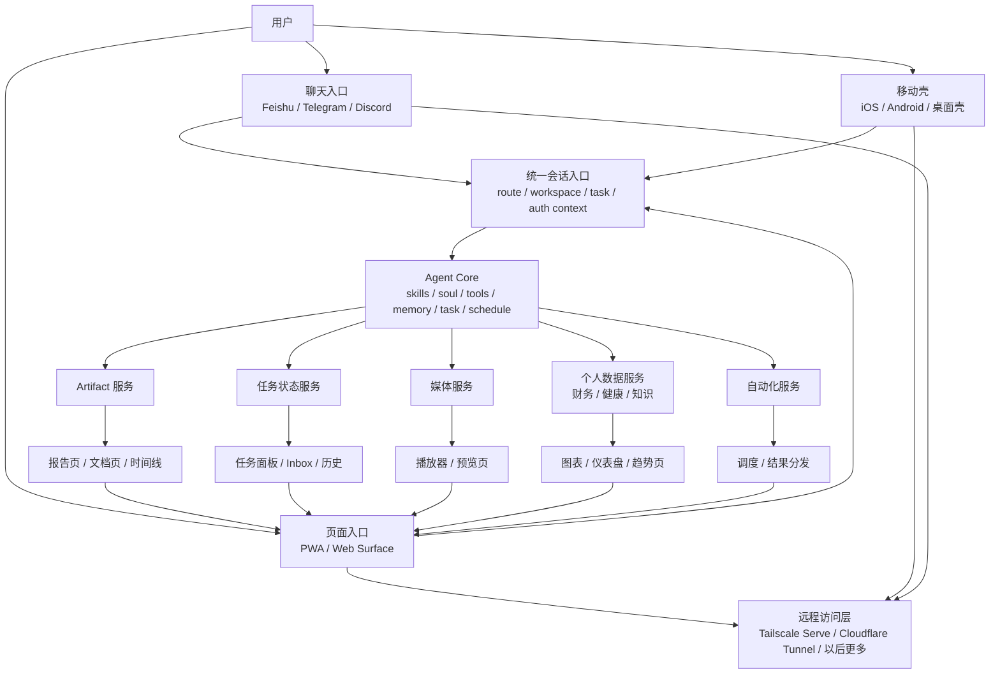
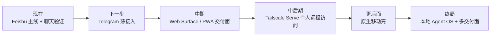

# msgcode 终局架构思考节点

## 结论

`msgcode` 的终局不是聊天机器人，也不是单纯的 PWA。

终局应该是：

**本地 Agent Core + 本地服务群 + 页面交付面 + 原生移动壳 + 聊天通道辅助入口**

其中：

- 聊天：入口、通知、轻控制
- 页面：结果交付、可视化、播放器、工作台
- 本机服务：数据、媒体、任务、artifact、自动化
- 原生壳：通知、后台、分享、安装、系统集成

## 终局架构图

## 终局分层

### 第一层：Agent Core

这是系统内核，负责：

- 技能与提示词
- 工具调用
- 长任务
- 调度
- 记忆
- route / workspace 真相源

要求：

- 本地优先
- 单一主链
- 不做厚控制面

### 第二层：Local Services

这是终局里非常关键但目前还没正式长出来的一层。

它不是新的控制平台，而是：

- artifact 输出服务
- 任务状态服务
- 媒体流服务
- 本地数据服务
- 自动化结果服务

它们的职责是：

**把智能体处理结果变成可被页面和移动端消费的稳定结果面。**

### 第三层：Rich Surfaces

这里不是“管理后台”，而是交付面。

典型页面：

- 每日报告
- 财务趋势图
- 健康趋势图
- 音乐/音频服务页
- 任务工作台
- artifact 浏览页

这层回答的是：

**结果该怎么被看见，而不是任务该怎么被执行。**

### 第四层：Reachability

这是手机和远程访问问题的真正归属层。

包含：

- Feishu / Telegram / Discord 这类通道
- Tailscale Serve
- Cloudflare Tunnel
- 以后可能的公网访问入口

它只负责：

- 触达
- 访问
- 深链跳转
- 远程打开页面/服务

不负责：

- 智能体本体
- 状态真相源
- 复杂控制逻辑

### 第五层：Mobile Shell

这是终局里大概率会出现的东西。

不是因为“App 更高级”，而是因为手机端存在硬需求：

- 通知
- 后台
- 安装
- 分享
- 文件与系统集成
- 更稳定的可达性

因此：

- `PWA` 适合中期验证
- `原生壳` 更像长期终局

## 关键判断

### 1. 聊天不是终局

聊天适合：

- 下达任务
- 追问
- 接收提醒
- 点击深链

聊天不适合：

- 大量图表
- 媒体服务
- 复杂报告
- 长时间浏览和交互

所以聊天应该退回：

**入口层**

而不是：

**最终交付层**

### 2. PWA 不是终局，但值得作为中期验证层

PWA 的价值：

- 快速验证页面交付面
- 验证信息架构
- 验证服务边界

PWA 的弱点：

- 通知
- 后台能力
- 安装心智
- 手机系统集成

所以：

- 中期：PWA 合理
- 长期：原生壳更合理

### 3. 终局会靠近 OpenClaw，但路径不能照抄

相似终局：

- 长期在线
- 移动入口
- 页面面
- 远程访问
- 多通道

不能照抄的部分：

- gateway 平台化
- pairing 体系
- mobile node 体系
- 大型控制面

正确路径：

**先长出服务与页面，再长出移动壳，而不是反过来。**

## 阶段推进图

## 当前推荐路线

### 现在做

1. 继续打磨 Feishu 主线
2. 设计 Telegram 薄适配
3. 设计 Web Surface 最小边界

### 接下来做

1. 页面交付面
2. artifact / task / report / media 统一输出协议
3. Tailscale Serve 小实验

### 暂时不做

1. 原生 App 全量开发
2. Gateway 平台化
3. Pairing / node / device framework
4. 自建中心服务器

## 最重要的一句话

`msgcode` 不应该被定义为聊天机器人。

它更准确的终局定义应该是：

**本地智能体服务系统**

聊天只是入口。  
页面是交付。  
服务是能力宿主。  
原生壳是移动触达。  

