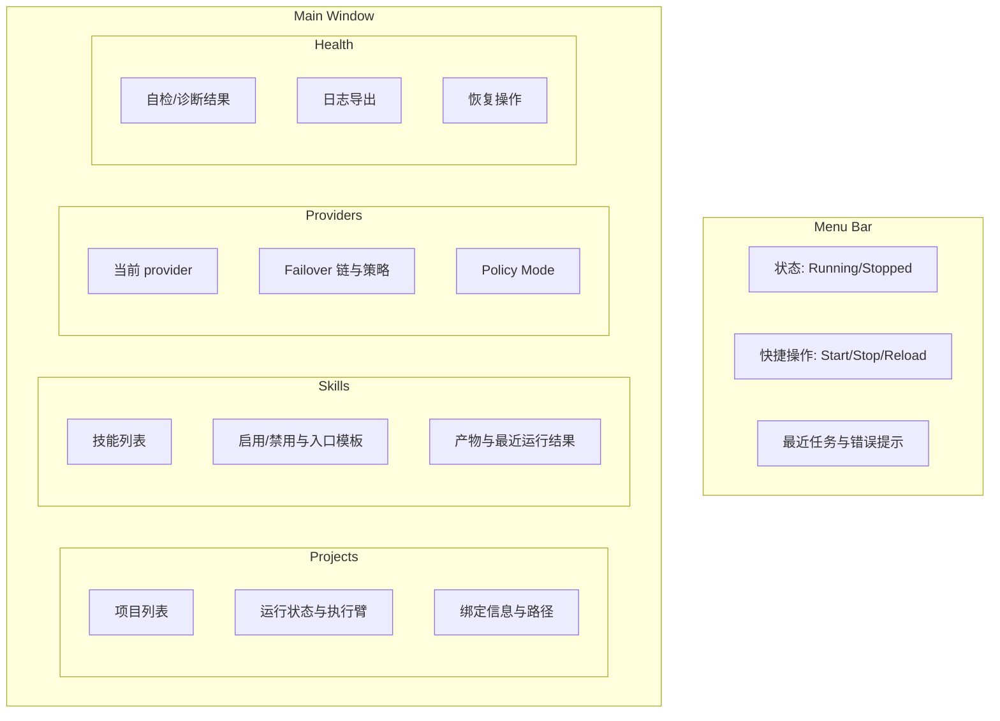

# msgcode Mac App 产品设计（v0.1）

## 1) 目标

- 面向普通用户提供稳定、可控的配置与运行入口。
- 隐藏 CLI 与执行复杂度，确保“可装、可跑、可自检、可恢复”。

## 2) 非目标

- 不在 App 内直接写业务逻辑或执行任务。
- 不与执行臂耦合（执行统一交给 msgcode daemon）。

## 3) 用户画像

- 普通用户：希望一键配置、可视化状态、最少手动命令。
- 技术用户：仍可使用 CLI，但 UI 必须覆盖主要场景。

## 4) 设计原则

- 单一真相源：`<workspace>/.msgcode/`。
- 单一中枢：msgcode daemon 负责执行与状态。
- 单一入口：Mac App 作为默认控制面，Menu Bar 辅助。

## 5) 页面结构图（页面结果图）

## 6) 关键流程

1. 首次启动
   - 选择工作区目录
   - 权限引导（辅助功能/磁盘）
   - 写入 `.msgcode` 与绑定
2. 日常运行
   - Menu Bar 查看状态
   - 主窗口切换 provider 与 failover
3. 故障处理
   - 一键自检
   - 导出日志
   - 恢复执行臂

## 7) 配置与状态

- 配置落盘：
  - `<workspace>/.msgcode/config.json`
  - `<workspace>/.msgcode/providers.json`
  - `<workspace>/.msgcode/failover.json`
- 状态来自 daemon（只读）：
  - 运行状态、错误原因、最近任务摘要

## 8) 权限与安全

- 明确显示权限缺失的影响面
- 引导用户一次性完成授权
- 高风险操作需用户确认

## 9) 发布与分发

- 目标：普通用户一键安装
- 形态：`DMG/PKG` 优先，Homebrew 作为开发者通道
- 安装包包含：App + daemon + CLI（CLI 对普通用户隐藏）
