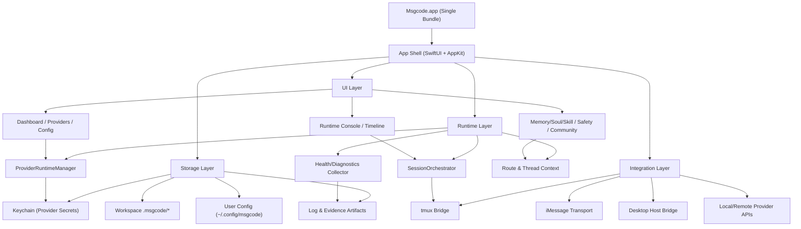
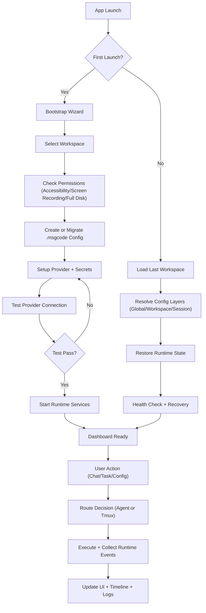

# msgcode GUI 信息架构与页面清单（v0.1）

## 1. 范围与目标

- 目标：给 GUI 建立可执行的信息架构和页面边界，作为后续设计与开发输入。
- 起点：从 `Provider Center` 起步，同时预留运行态、治理和社区扩展位。
- 交付形态：`单 App`（一个 `.dmg`，拖拽一个 App 即可安装使用）。
- 非目标：本版不定义视觉风格细节，不定义最终交互文案。

## 2. 单 App 内部模块图

## 3. 启动流程图（First Run + Daily Run）

## 4. 导航结构

- 一级导航
  - `Dashboard`
  - `Providers`
  - `Config`
  - `Runtime`
  - `Timeline`
  - `Governance`
  - `Community`
  - `Settings`

- 全局固定区
  - 顶栏：当前工作区、当前执行线（agent/tmux）、当前 active provider、健康状态。
  - 右上角：快速动作（Reload、Test Provider、Export Diagnostics）。

## 5. 页面清单（按阶段）

| 阶段 | 页面 ID | 页面名称 | 核心职责 | 主要数据源 |
|---|---|---|---|---|
| P0 | `P0-01` | Dashboard | 状态总览与关键告警 | runtime snapshot / provider state |
| P0 | `P0-02` | Provider List | 管理 provider 列表与 active 选择 | `<workspace>/.msgcode/providers.json` |
| P0 | `P0-03` | Provider Edit & Test | 新增/编辑 provider、连通性测试 | provider registry + runtime test |
| P0 | `P0-04` | Provider Secrets | 管理 API Key 与 secret headers | Keychain |
| P0 | `P0-05` | Failover Policy | 配置重试/切换/降级策略 | failover policy config |
| P0 | `P0-06` | Configuration Center | 展示 Global/Workspace/Session 覆盖关系 | `.env` + workspace config |
| P1 | `P1-01` | Runtime Console | 请求执行态与恢复动作可视化 | runtime manager state |
| P1 | `P1-02` | Task/Thread Timeline | 按 traceId 追踪一条任务全链路 | thread store + action journal |
| P1 | `P1-03` | Project & Bindings | 群聊绑定、工作区切换、执行线切换 | route store + workspace config |
| P2 | `P2-01` | Memory Studio | 记忆浏览、去重、压缩、治理 | `.msgcode/memory/*` |
| P2 | `P2-02` | Soul/Skill Studio | SOUL/Skill 启用、版本、覆盖关系 | soul/skill files + active map |
| P2 | `P2-03` | Safety Center | 工具权限、外联策略、文件作用域 | tooling/policy config |
| P3 | `P3-01` | Template Hub | 模板浏览、导入、复用 | community package index |
| P3 | `P3-02` | Publish Package | 脱敏导出与发布模板包 | local package manifest |
| P3 | `P3-03` | Compatibility Matrix | provider/runtime/skill 兼容矩阵 | telemetry + package metadata |

## 6. P0 页面最小验收标准

- `Provider List`
  - 可新增、编辑、删除、启停 provider。
  - 可设置 `active provider`，并实时显示状态（ready/connecting/error）。

- `Provider Edit & Test`
  - 支持预设模板（OpenAI-compatible、OpenAI、MiniMax、Custom）。
  - 支持连接测试，显示模型发现数量与错误详情。

- `Provider Secrets`
  - 明文不落盘；支持设置、轮换、删除 API Key。
  - provider 删除时可选择级联清理密钥。

- `Failover Policy`
  - 可配置 retry、failover、degraded 三段策略。
  - 显式声明“同一工具回合不切 provider，只在下一轮切换”。

- `Configuration Center`
  - 显示配置来源（Global/Workspace/Session）。
  - 支持差异对比（diff）与一键恢复默认。

## 7. 关键交互流（P0）

1. 新建 provider
- `Provider List` -> `Add` -> `Provider Edit & Test` -> `Save` -> `Set Active`

2. 修复异常 provider
- `Dashboard` 告警 -> `Provider List` 查看错误 -> `Provider Edit & Test` 重测 -> `Failover Policy` 调整降级策略

3. 排查“为什么这次走了某个 provider”
- `Runtime Console` 查看 execution 记录 -> `Configuration Center` 查看覆盖来源 -> `Timeline` 追溯 traceId

## 8. 数据与状态边界

- 配置层（可落盘）
  - `providers.json`
  - workspace config
  - failover policy config

- 密钥层（不可落盘）
  - Keychain（provider key、secret headers）

- 运行态层（内存态）
  - provider status / retry / failover / degraded

## 9. 与现状兼容策略

- 读取优先级
  1) workspace provider registry
  2) legacy workspace provider field
  3) global env (`AGENT_BACKEND`)

- 写入策略
  - GUI 先写新结构；
  - 过渡期双写 legacy；
  - 稳定后收敛单写新结构。

## 10. 单 App 交付说明

- 用户视角：下载一个 `.dmg`，拖拽一个 `Msgcode.app`。
- 系统视角：同一 App 内部分层运行（UI + Runtime + Storage + Integrations）。
- 运维视角：故障恢复与诊断都在 App 内完成，不要求用户使用 CLI。
